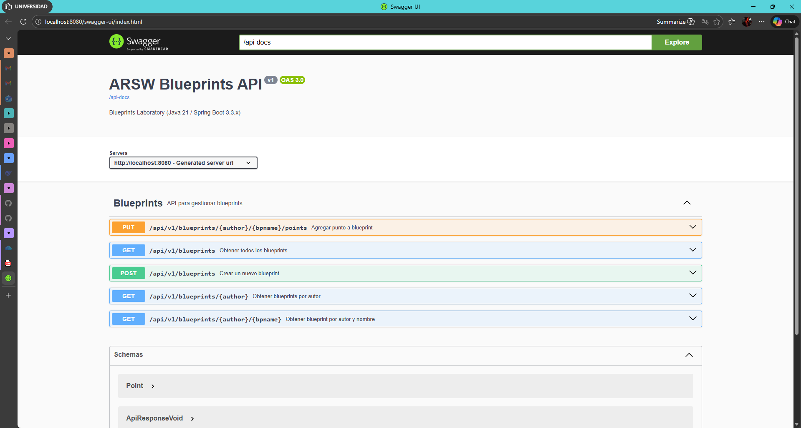
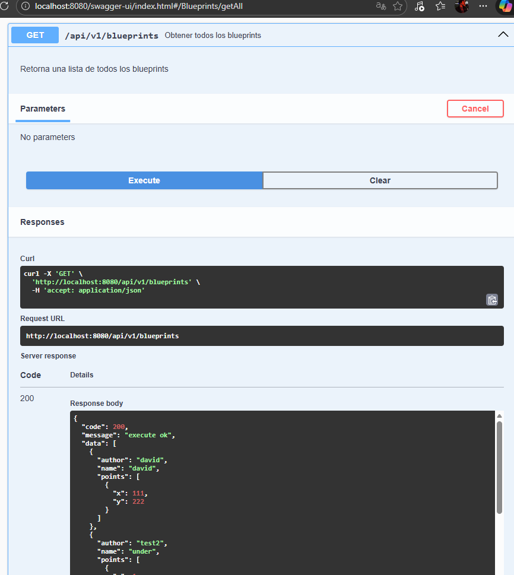
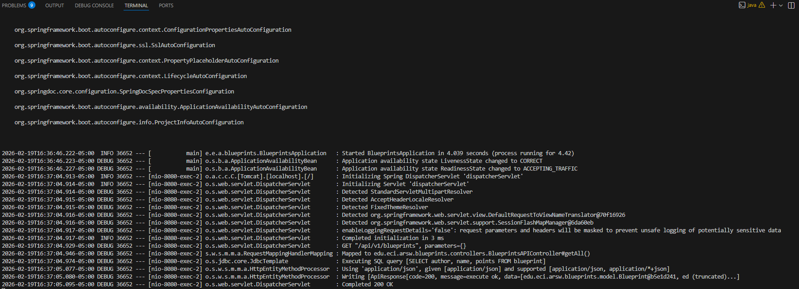
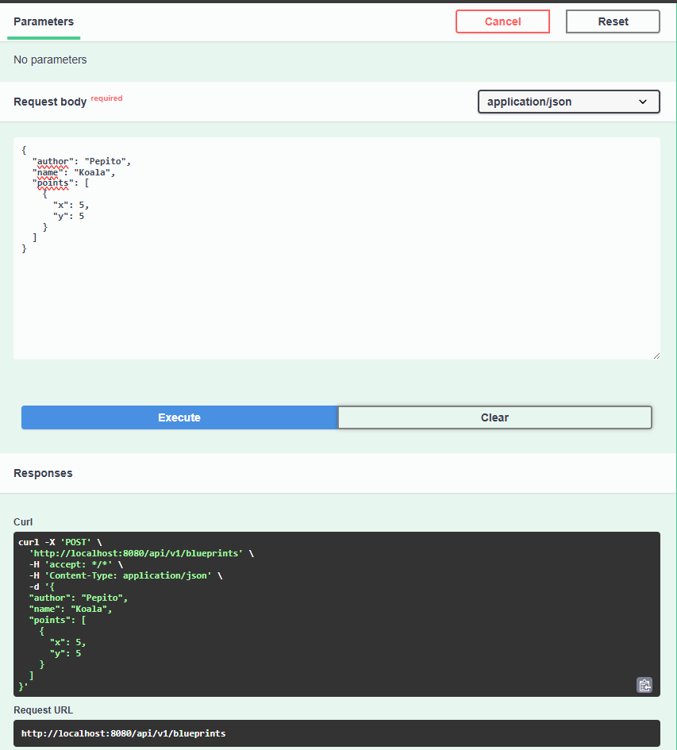
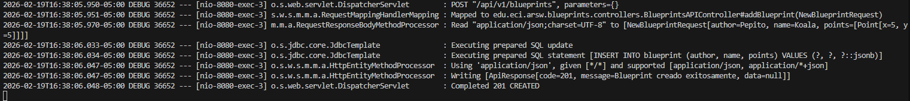
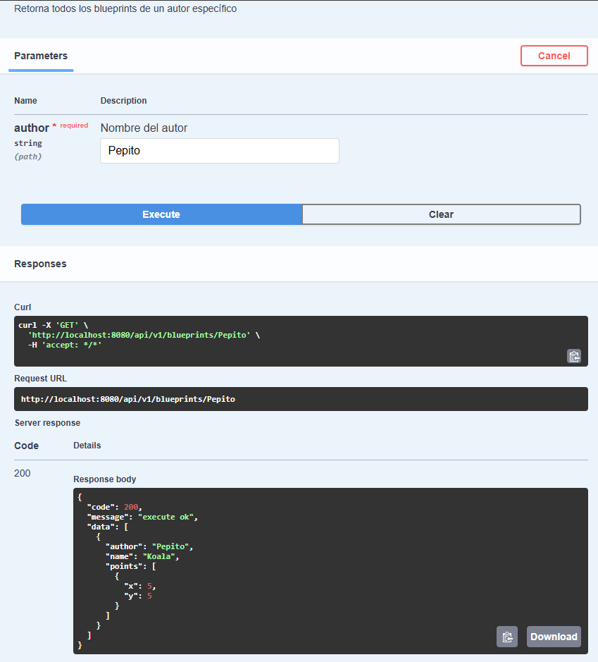
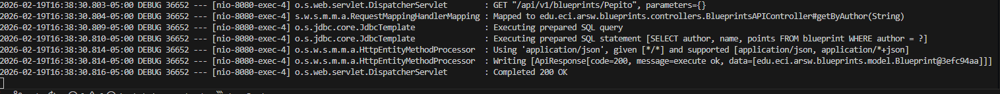
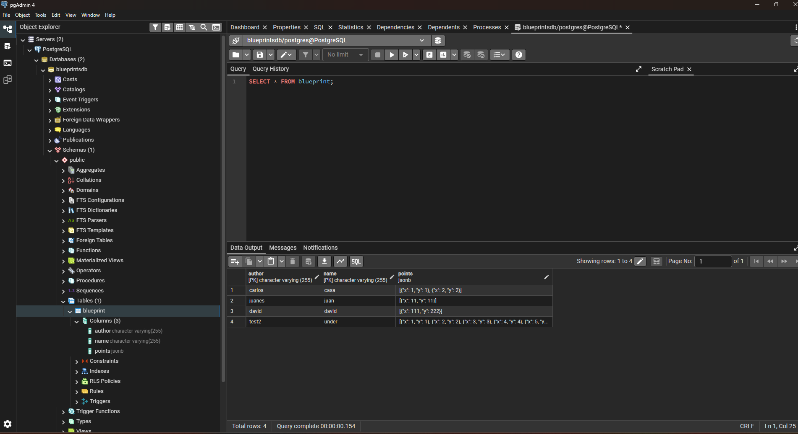

# Informe de Laboratorio 04: Blueprints REST API & Persistence

## 1. Instrucciones de Ejecución

### Requisitos Previos
- Java 21
- Maven
- PostgreSQL (Base de datos: `blueprintsdb`, Usuario: `postgres`, Password: `12345`)

### Comandos
1.  **Limpiar y construir el proyecto:**
    ```bash
    mvn clean install
    ```
2.  **Ejecutar la aplicación:**
    ```bash
    mvn spring-boot:run
    ```

3.  **Acceder a la documentación API (Swagger UI):**


---

## 2. Evidencia de Funcionamiento

### A. Consultas en Swagger UI

#### 1. Obtener todos los Blueprints (`GET /api/v1/blueprints`)



#### 2. Crear un Blueprint (`POST /api/v1/blueprints`)



#### 3. Consultar por Autor (`GET /api/v1/blueprints/{author}`)



### B. Evidencia en Base de Datos



## 3. Buenas Prácticas Aplicadas

En este laboratorio se han aplicado las siguientes buenas prácticas de diseño y arquitectura de software:

### 1. Arquitectura en Capas y Principio de Responsabilidad Única (SRP)
Se mantuvo una clara separación de responsabilidades:
-   **Model**: Entidades de dominio (`Blueprint`, `Point`) puras, ahora adaptadas para JPA.
-   **Persistence**: Interfaz `BlueprintPersistence` que desacopla la lógica de negocio de la tecnología de almacenamiento. Esto permitió implementar `PostgresBlueprintPersistence` sin modificar los servicios.
-   **Services**: `BlueprintsServices` contiene la lógica de negocio y orquestación, sin depender directamente de controladores o base de datos.
-   **Controllers**: `BlueprintsAPIController` maneja exclusivamente la capa HTTP (códigos de estado, serialización JSON), delegando la lógica al servicio.

### 2. Diseño de API REST
-   **Recursos y Verbos HTTP Correctos**: Se utilizaron sustantivos en plural para los recursos (`/blueprints`) y verbos HTTP adecuados (`GET` para consultas, `POST` para creación, `PUT` para actualizaciones).
-   **Códigos de Estado HTTP**: Se implementó el uso semántico de códigos de estado:
    -   `200 OK`: Consultas exitosas.
    -   `201 Created`: Recurso creado exitosamente.
    -   `202 Accepted`: Solicitud de actualización aceptada.
    -   `404 Not Found`: Recurso no encontrado.
    -   `400 Bad Request`: Error en los datos de entrada (validación).
    -   `409 Conflict`: Intento de crear un recurso existente.

### 3. Estandarización de Respuestas (`ApiResponse<T>`)
Se implementó un wrapper genérico `ApiResponse<T>` para unificar la estructura de todas las respuestas de la API. Esto facilita el consumo por parte del cliente, ya que siempre recibe un formato predecible:
```json
{
  "code": 200,
  "message": "success",
  "data": { ... }
}
```

### 4. Inyección de Dependencias
Se utilizó `Spring Framework` para la inyección de dependencias (`@Autowired` / Constructor Injection), permitiendo cambiar fácilmente la implementación de persistencia (Memoria vs Postgres) y filtros mediante perfiles (`@Profile`), sin modificar el código cliente.

### 5. Documentación Automática (OpenAPI/Swagger)
Se integró `springdoc-openapi` para generar documentación viva de la API. Esto permite a los desarrolladores probar endpoints directamente desde el navegador y entender la estructura de peticiones y respuestas sin leer el código fuente.
